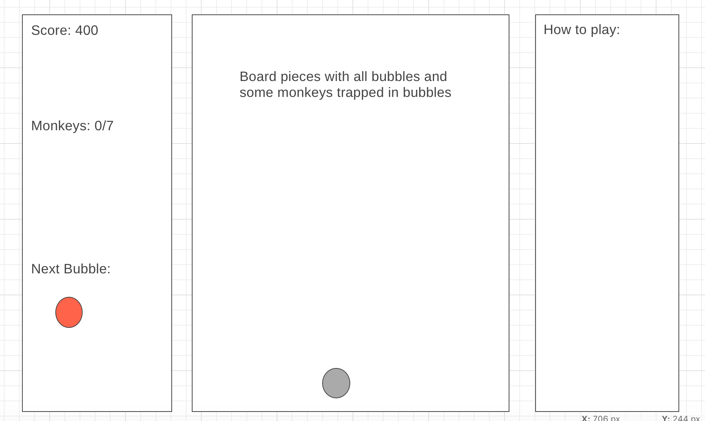

#Monkey Bubble Pop

* Background and Overview

    Monkey Bubble Pop is a fun game which is a clone of the classic bubble shooter game. Player has to start shooting a new bubble in a direction so as to match the color of 3 or more adjacent bubbles in order to pop them and rescue monkeys which are trapped in bubbles. The target is popping out maximum nmber of bubbles to increase the score and also rescue the target number of monkeys at each level.

    There are 3 levels to this game. The first level is easy as the shooter bubble will match the color of the bubbles at the lowest level so as to easily pop them. The next level will be a little harder as the shooter bubble will not necessarily match the bubbles at the lowest level but the color will match the color of bubbles which are shown in the board. The third level is even harder as the board generated will not have many adjacent balls of same color.

* Functionality and MVP Features

    The users will be able to

    * Shoot the bubble to match and pop matching color bubbles
    * See the number of moves allowed at every level
    * See the target number of monkeys to be rescued
    * Able to see the next shooter bubble in the queue
    * Receive an alert if the game is over
    * Receive an alert if the player has moved to the next level

    * When a group of bubbles is popped, the loose bubbles below that group should pop as well.
    * The game is over if the player shoots the bubbles in a way that the lowest level bubble reaches the bottom of the board       or the number of moves has exceeded the number of allowed moves.

* Wireframes

    
    * There will be a board at the center
    * There will be a shooter ball at the bottom of the board in the center
    * Right sidebar will describe how to play
    * Left sidebar top portion will show the next shooter bubble
    * Left sidebar bottom portion will show the total score and number of monkeys rescued out of the target

* Architecture and Technology

    * Javascript
    * HTML Canvas
    * CSS
    * Webpack

    * board.js 
        * generateRandomBoard by Level
        * Place monkeys 
    * pieces.js
        * Have Information about all the pieces - color, position on the board, type of piece
    * game.js
        * Keep on generating the next move until the game is over
        * When one level is over move to the next level

* Implementation Timeline

    * Day 1
        * Learn how to render image of monkeys through HTML Canvas
        * Setup the webpack with basic entry file

    * Day 2
        * Generate an initial random board filled with bubbles for level 1
        * Learn how to make a shooter bubble to shoot at a target angle selected by the user
        * Make the shooter ball move at the desired angle and be placed appropriately

    * Day 3
        * Pop the bubbles if 3 or more bubbles of matching colors are adjacent and increase the score
        * Increase the number of monkeys rescued if rescued any move

    * Day 4
        * Write game logic for level 2 and 3

    * Day 5
        * Check if all pieces of the game are working together and resolve if there are any issues

* Bonus Features

    * Hear sound on popping of bubbles
    * Mute the sound
    * Show a nice HTML Canvas as a backdrop in the board matching the theme of the game
    * Different sound effects for popping bubble and rescuing a monkey
    * Add more levels to the game

